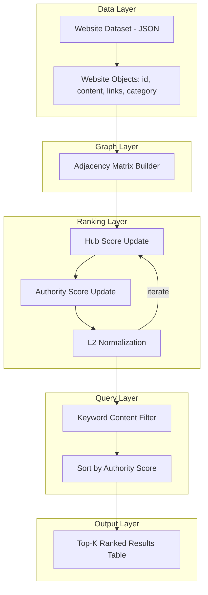
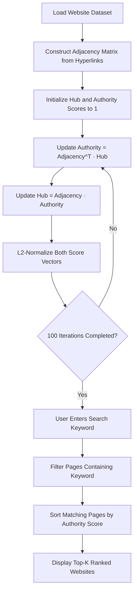

<div align="center">
  
</div>

---

# HITS Algorithm Web Search Ranking Engine

A from-scratch implementation of the HITS (Hyperlink-Induced Topic Search) algorithm that models a synthetic web as a directed hyperlink graph, computes Hub and Authority scores through power iteration, and ranks pages relevant to a user's search keyword purely from link structure and content matching.

<div align="left">

[](https://www.python.org/)
[](https://numpy.org/)
[](https://jupyter.org/)
[](#)
[](#)
[](#)
[](https://opensource.org/licenses/MIT)

</div>

## Abstract

Classical link-analysis algorithms such as HITS treat the web as a directed graph in which pages that point to many good resources become strong **hubs**, and pages pointed to by many good hubs become strong **authorities**. This project implements the HITS algorithm entirely with NumPy — without any external graph or search libraries — over a synthetic dataset of 1,000 interlinked web pages spanning the *news*, *sport*, and *fun* categories. Given a search keyword, the system filters pages whose content matches the query, ranks them by their converged Authority score, and returns a clean, tabulated top-k result set, closely mirroring how real-world link-based search engines surface relevant results.

## Table of Contents

1. [Overview](#overview) — Motivation and Problem Definition
2. [System Architecture](#system-architecture) — Layered Graph-Based Ranking Pipeline
3. [Algorithm Workflow](#algorithm-workflow) — From Hyperlink Graph to Ranked Results
4. [Methodology](#methodology) — The HITS Hub and Authority Update Rule
5. [Dataset](#dataset) — Synthetic Hyperlinked Web Corpus
6. [Example Usage](#example-usage) — Sample Keyword Search
7. [Project Structure](#project-structure) — Repository Organization
8. [Usage and Installation](#usage-and-installation)
9. [License](#license)
10. [Author](#author)
11. [Support](#support)

# Overview

Search engines cannot rank pages by textual relevance alone — the structure of the web itself carries a strong relevance signal. The HITS algorithm captures this by assigning every page two complementary scores: a **Hub score**, reflecting how well a page points to valuable resources, and an **Authority score**, reflecting how much a page is regarded as valuable by other hubs. This project builds a small search engine around that idea:

* Load a hyperlinked web corpus and represent it as a directed graph
* Construct the graph's adjacency matrix from page-to-page links
* Compute Hub and Authority scores via iterative power-method updates
* Accept a keyword query, filter matching pages by content, and rank them by Authority score
* Present the top-k most relevant, best-supported pages in a formatted result table

---

# System Architecture

The system follows a layered pipeline in which raw hyperlink data is transformed into a graph representation, scored through iterative link analysis, and finally filtered and ranked against a user's query.



### Architectural Components

| Layer | Responsibility |
|:-------|:-----------------|
| Data Layer | Parsing the JSON corpus into structured `Website` objects |
| Graph Layer | Building the directed adjacency matrix from outgoing links |
| Ranking Layer | Computing and normalizing Hub and Authority scores via power iteration |
| Query Layer | Filtering pages by keyword and ranking them by Authority score |
| Output Layer | Formatting and displaying the top-k relevant results |

This separation keeps link analysis fully decoupled from query handling, so the same precomputed Hub/Authority scores can be reused across any number of searches without re-running the iterative computation.

# Algorithm Workflow



---

# Methodology

The ranking engine follows the original HITS formulation, implemented as a pure power-iteration process over the graph's adjacency matrix `A`:

```
Authority = Aᵀ · Hub
Hub       = A  · Authority
```

After every update, both score vectors are re-normalized to unit L2 norm to prevent unbounded growth across iterations:

```python
auth_score /= np.linalg.norm(auth_score)
hub_score  /= np.linalg.norm(hub_score)
```

This process is repeated for 100 iterations, which is sufficient for the Hub and Authority vectors to converge to their dominant eigenvector solutions. Once converged, a keyword search filters the pages whose textual content contains the query term and orders the matches by their final Authority score — meaning the results are not just textually relevant, but also structurally endorsed by the most influential hub pages in the graph.

---

# Dataset

The corpus (`DATASET.json`) is a synthetic collection of **1,000 web pages**, each represented as:

| Field | Description |
|:-------|:--------------|
| `id` | Unique numeric identifier of the page |
| `content` | Short textual snippet describing the page's content |
| `links` | List of page IDs that this page links to (outgoing edges) |
| `category` | Topic label — `news`, `sport`, or `fun` |

This link structure is exactly what the adjacency matrix is built from, making the dataset a compact but realistic testbed for link-based ranking algorithms.

---

# Example Usage

A sample run of the notebook, searching for the keyword **"race"** and requesting the top 10 results:

```
Enter the word you wanna search: race

Number of results for the word "race" = 19
How many top sites do you want to be displayed? 10

Top 10 websites for the word "race" are:

|------|-----|----------|------------|-------------------|
| Rank | ID  | Category | Hub Score  |  Authority Score  |
|------|-----|----------|------------|-------------------|
| 1    | 557 | news     |  0.01150   |      0.03611      |
| 2    | 519 | sport    |  0.02468   |      0.03497      |
| 3    | 585 | sport    |  0.04563   |      0.03400      |
| 4    | 395 | sport    |  0.03377   |      0.03332      |
| 5    | 481 | news     |  0.01271   |      0.03325      |
| 6    | 81  | fun      |  0.03657   |      0.03303      |
| 7    | 289 | fun      |  0.04372   |      0.03196      |
| 8    | 720 | fun      |  0.03646   |      0.03180      |
| 9    | 957 | sport    |  0.02207   |      0.03175      |
| 10   | 27  | news     |  0.02337   |      0.03168      |
```

---

# Project Structure

```
HITS-Algorithm-Web-Search-Ranking-Engine
│
├── HITS_web_search_ranking.ipynb
├── DATASET.json
└── README.md
```

---

# Usage and Installation

## Clone Repository

```bash
git clone https://github.com/ParmidaGh/HITS-Algorithm-Web-Search-Ranking-Engine.git
cd HITS-Algorithm-Web-Search-Ranking-Engine
```

## Create Environment

```bash
conda create -n hits-search python=3.10
conda activate hits-search
pip install numpy notebook
```

## Run the Notebook

```bash
jupyter notebook hits_web_search_ranking.ipynb
```

Update the dataset path inside `load_web(...)` to point to your local copy of `DATASET.json`, then run all cells. When prompted, enter a search keyword and the number of top results to display.

---

# License

This project is licensed under the MIT License.

---

## Author

**Parmida Ghamari**
M.Sc. Student, University of Tehran
Research Assistant @ Social Networks Lab

**Research Interests:** Information Retrieval, Web Mining, Graph-Based Ranking Algorithms (HITS, PageRank), Data Mining, Natural Language Processing (NLP)

📧 [Parmida.ghamari@gmail.com](mailto:Parmida.ghamari@gmail.com) | 💻 [github.com/ParmidaGh](https://github.com/ParmidaGh) | 💼 [www.linkedin.com/in/parmida-ghamari](https://www.linkedin.com/in/parmida-ghamari)

---

# Support

If you find this project useful, consider giving it a star ⭐

---

<p align="center">
  Built using Python and NumPy
</p>
